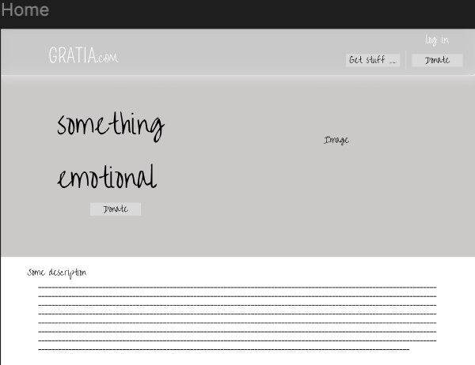
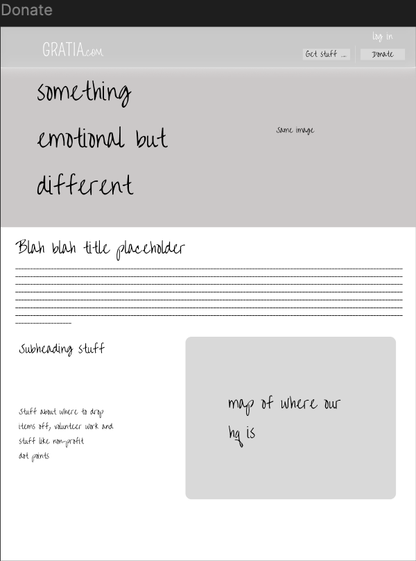
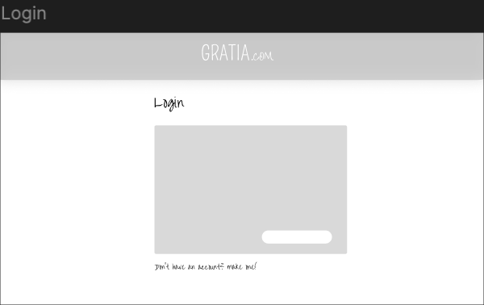
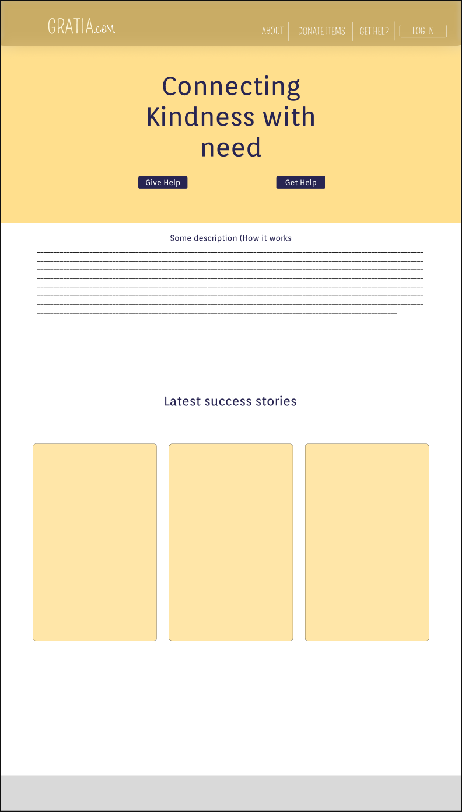
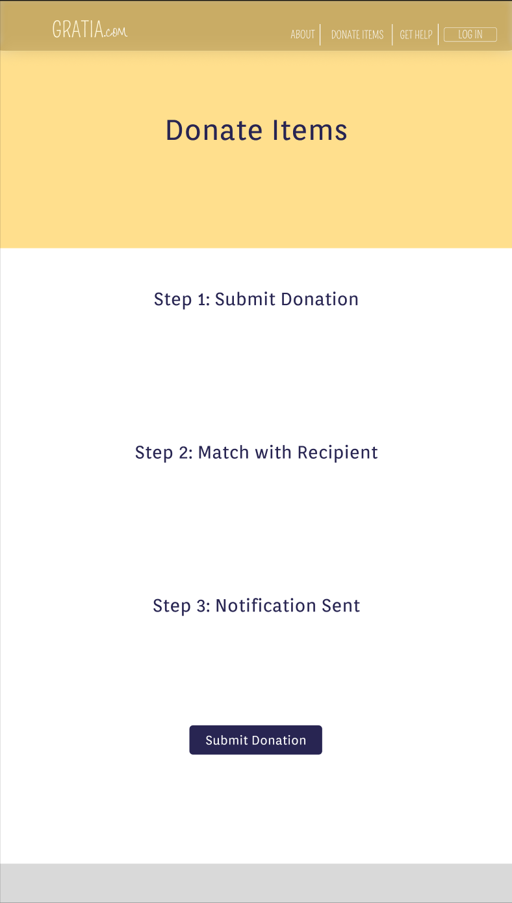
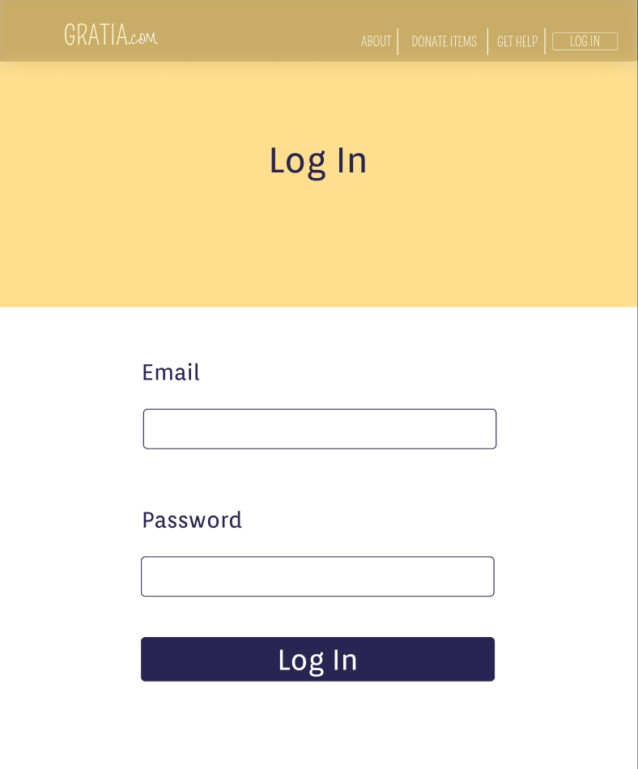
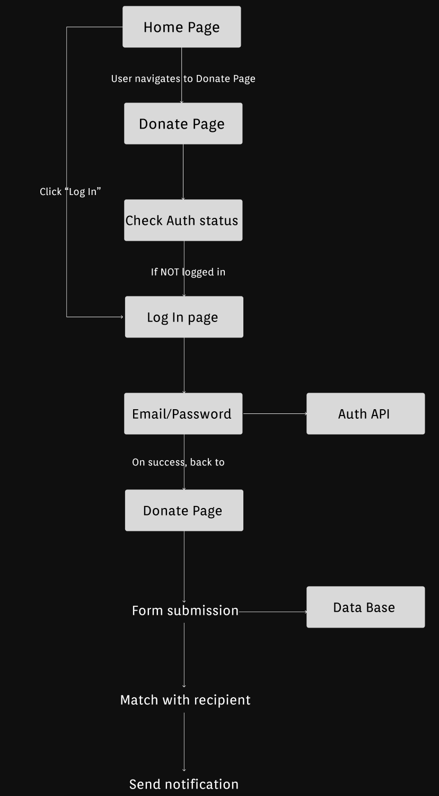

# **The Document**

## **Week 1 - Brainstorming**

### Project Description
This project aims to develop an efficient charity platform that uses the process of matching donations with recipients' needs. The system categorises requests from individuals in need, allowing donated items to be sorted accordingly. When a donation matches a recipient's requirements, the platform automatically notifies the recipient, enabling them to collect the item at a designated location. This approach improves the efficiency and effectiveness of our charity giving by ensuring that donations reach those who need them most in a timely manner.

### Functional Requirements
- Users should be able to register into the website with a username and passwords and also they should be able to login with that credentials if in the case where they log out
- Users should be able to locate the position of interest where they can collect their donations/be able to donate their items
- Users should be able to identify what they are in need so that they get pinged when their item is available

### Non-Functional Requirements
- Website should be able to load within 1.5s
- All passwords should be encrypted for increased security also locations of users should be encrypted as well in case of a data leak
- The system should be able to handle at least 1000+ people at the same time without slowing down

## **Week 2 - Creating framework for the website**
|Aspect of Design|Description|
|--------------------|----------------------------------|
|Landing/Home page|The home page should display the logo and website name, along with the ability to navigate to different areas of the website such as donate, login/sign up,etc. It also should have to ability to swap the login with the user profile when the user is logged in, the page should also have description of the company's goal/purpose|
|Donate Page|This page is primarily for informing the donaters on why they should donate and the impacts of donating their items to help the needy, it also should display an interactive google maps displaying where the company HQ is, it also has description on becoming an volunteer since the company is a non-profit company.|
|Login/Signup Page|This page is aimed at registering an user, it requires the user to provide an email, name and password (encrypted) to sign up to the website, the purpose of this is to make sure that there is a way to identify the user when they are collecting or donating items, it also makes sure that there are no one that is making multiple accounts to leech off the generocity of the company.|
|Colour palette|Primarily: Grey. Secondary:White. Other colours: Orange|
|Other pages|Profile page, Request items page, donation 'points' page, top donaters (weekly, monthly). These are the pages that are not included in the framework.|

### Images of framework

**Home Page**

**Donate Page**

**Login Page**

## **Week 3 - Alternate Designs**

| Aspect of Design | Description |
|------------------|-------------|
| Overall Theme | Warm, welcoming, and calming design with a blocky yet rounded font to create a sense of security. |
| Home Page | Added extra navigation buttons at the top for easier navigation. Included a "stories" section for users to share their experiences.  |
| Donate Page | Simplified layout focusing on explaining the donation process. Introduced a universal yellow placeholder at the top across the website.  |
| Login Page | Removed borders and enlarged the font for better accessibility.  |
| Flow Diagram | Visual representation of the user flow and background processes triggered by user actions.  |

## **Week 4 - Designing Algorithms**

### Designing an algorithm for one functional component

### Design 2 test cases

#### **Pseudocode**

1. Authenticate and Authorise
- 1.1 Verify `session_token`: decode, check expiry
- 1.2 if invalid -> `return "error: authentication required"`
- 1.3 Fetch `donor_id` from session

2. Validate Input
- 2.1 Check required fields (`item_title`, `category`, `location`)
- 2.2 Validate field types, allow enums (category, conditions)
- 2.3 Validate `images[]` sizes and types (scan for malware if applicable)
- 2.4 If validation fails -> return error: `"validation_failed with details"`

3. Normalise
- 3.1 Trim strings, remove unsafe characters, limit lengths
- 3.3 Enforce privacy options (do not store contact if `privacy_options` restricts it)

4. Begin Database Transaction
- 4.1 Start DB transaction to ensure security for initial save + possible immediate match

5. Create Donation Record
- 5.1 Insert into `Donations` with status = `PENDING_MATCH` (include donor_id)
- 5.2 Save images to object store and store refs in DB
- 5.3 Commit the insert (but keep transaction open if attempting immediate match in same transaction)

6. Check for Immediate Matching Candidates
- 6.1 Build candidate query against `Recipients` where:

- `active = true`
- `need_category == donation.category` (or category mapping)
- `location` within acceptable radius (e.g., 20km) OR matches recipient’s delivery preference
- `condition` acceptable to recipient (if required)
- `quantity_needed > 0`

- 6.2 If zero candidates → go to Step 9 (no immediate match)
- 6.3 If candidates found → compute a match score for each candidate (see Step 7)

7. Scoring Function (ex)
- 7.1 Score components (weighted):
   Category match (binary) -> weight 40%
   Distance score (closer higher) -> weight 25%
   Urgency match (recipient urgency vs donation availability) -> weight 20%
   Quantity fit (donation >= recipient need) -> weight 10%
   Past donor/recipient compatibility (trust metrics) -> weight 5%

- 7.2 Compute `score = w1*category + w2*distance + ...`
- 7.3 Sort candidates by descending score

8. Reserve Top Candidate
- 8.1 Select top candidate `recipient_id`
- 8.2 Create Matches record with `status = PENDING_CONFIRMATION`, `reserved_until = now + RESERVATION_TTL` (e.g., 48 hours)
- 8.3 Update `Donations.status = RESERVED` and link `match_id`
- 8.4 Commit DB transaction
- 8.5 Enqueue notification job (email/SMS/in-app) with `match_id` to notify recipient and donor (respecting privacy options)
- 8.6 Return `status: matched` with donation_id and match_id

9. No Immediate Match
- 9.1 Commit DB transaction (if still open) keeping `Donations.status = PENDING_MATCH`
- 9.2 Insert into matching queue with backoff schedule (e.g., immediate retry after 1 hour, daily for 7 days)
- 9.3 Creates public listing for recipients to browse (If donator allows)
- 9.4 Return `status: queued_unmatched`.

10. Asynchronous Match Worker (background)
- 10.1 Periodically pick `PENDING_MATCH` donations
- 10.2 Re-run matching candidate search & scoring (Steps 6–8)
- 10.3 If a match is made, proceed to reservation/notifications
- 10.4 If donation expires (available_until passed) -> mark `Donations.status = EXPIRED` and notify donor of expiry

11. Notifications and Confirmation
- 11.1 Send recipient notification (email/SMS/in-app), including:

- Donation details (title, description, location if allowed by donor privacy settings)
- Link/button to “Accept” or “Decline” donation

- 11.2 **Send donor notification** that a match is pending recipient confirmation

12. Recipient Action Handling
- 12.1 If recipient clicks “**Accept**”:
- Verify that the match is still valid (donation not expired, not already accepted by another recipient)
- Update `Matches.status = CONFIRMED`
- Update `Donations.status = MATCHED_CONFIRMED`
- Notify donor to arrange handover (contact info exchanged if allowed by privacy settings)

- 12.2 If recipient clicks “**Decline**”:
- Update `Matches.status = DECLINED`
- Set `Donations.status = PENDING_MATCH` again
- Trigger the asynchronous match worker to find a new recipient

13. Handover and Completion
- 13.1 Once both parties agree on logistics:
- Mark donation as “In Transit” or “Ready for Pickup”

- 13.2 After the item is received, either:
- Recipient confirms receipt via app
- Or system auto-confirms after a timeout if no disputes reported

- 13.3 Update:
- `Donations.status = COMPLETED`
- `Matches.status = COMPLETED`

14. Feedback/Review system
- 14.1 Prompt both donor and recipient for feedback and ratings
- 14.2 Store ratings for trust score calculations in future matches

15. Data Logging
- 15.1 Log all key events (submission, match attempt, notification, acceptance, completion) in an `EventLog` table
- 15.2 These logs are used for: Analytics and **Fraud detection**/**Abuse prevention**

**Test Case 1**

Test Case ID: A unique identifier for easy reference.
Test Case Name: A short, descriptive title of what’s being tested.
Preconditions: Any setup or initial conditions that must be met before testing begins.
Test Steps:
Clear, step-by-step instructions on how to execute the test.
Expected Result: What should happen after performing the test steps.
Actual Result: What actually happens during testing (filled out after execution).
Pass/Fail: A simple indication of whether the test succeeded or failed.
Priority: Helps categorise the importance of the test.

**Test Case 2**

Test Case ID: A unique identifier for easy reference.
Test Case Name: A short, descriptive title of what’s being tested.
Preconditions: Any setup or initial conditions that must be met before testing begins.
Test Steps:
Clear, step-by-step instructions on how to execute the test.
Expected Result: What should happen after performing the test steps.
Actual Result: What actually happens during testing (filled out after execution).
Pass/Fail: A simple indication of whether the test succeeded or failed.
Priority: Helps categorise the importance of the test.